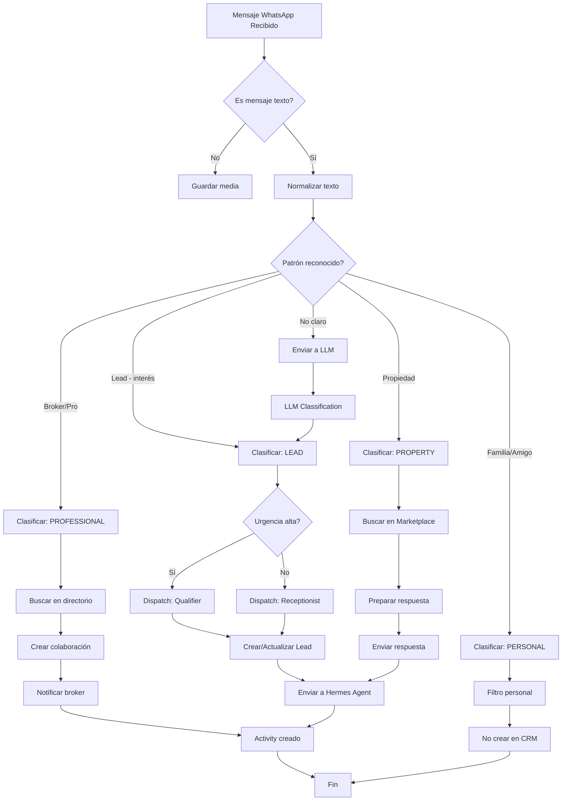

# Plan de Integración OpenWA + Hermes + Rovi CRM

## Objetivo

Crear un sistema integral que permita a brokers e inmobiliarias de Rovi vincular su WhatsApp personal, clasificar automáticamente los mensajes entrantes, y asignar agentes de Hermes según el contexto detectado.

---

## 🏗️ Arquitectura Propuesta

```
┌─────────────────────────────────────────────────────────────────────────────┐
│                         WhatsApp Personal del Broker                         │
└───────────────────────────────────────┬─────────────────────────────────────┘
                                    │ OpenWA/wa-automate
                                    │ (WebSocket connection)
┌───────────────────────────────────────┴─────────────────────────────────────┐
│                        Rovi WhatsApp Gateway Service                         │
│  ┌─────────────────┐  ┌──────────────────┐  ┌──────────────────────────┐  │
│  │ OpenWA Manager   │  │ Message          │  │ Classifier Engine         │  │
│  │ (QR, Sessions)  │  │ Router           │  │ (Lead/Propiedad/Family)  │  │
│  └─────────────────┘  └──────────────────┘  └──────────────────────────┘  │
│  ┌─────────────────┐  ┌──────────────────┐  ┌──────────────────────────┐  │
│  │ CRM Integrator  │  │ Agent Orchestrator│  │ Analytics & Reporting    │  │
│  │ (Lead Creation) │  │ (Hermes Dispatch) │  │ (Conversations)          │  │
│  └─────────────────┘  └──────────────────┘  └──────────────────────────┘  │
└───────────────────────────────────────┬─────────────────────────────────────┘
                                    │ REST API
┌───────────────────────────────────────┴─────────────────────────────────────┐
│                         Rovi Backend (FastAPI)                              │
│  ┌─────────────────┐  ┌──────────────────┐  ┌──────────────────────────┐  │
│  │ Message Storage │  │ Classification    │  │ Hermes Bridge             │  │
│  │ (MongoDB)       │  │ Rules Engine      │  │ (Agent Dispatch)          │  │
│  └─────────────────┘  └──────────────────┘  └──────────────────────────┘  │
└─────────────────────────────────────────────────────────────────────────────┘
                                    │
┌───────────────────────────────────────┴─────────────────────────────────────┐
│                         Hermes Agent System                                 │
│  ┌─────────────────┐  ┌──────────────────┐  ┌──────────────────────────┐  │
│  │ Receptionist    │  │ Lead Qualifier   │  │ Sales Follow Up           │  │
│  │ Agent           │  │ Agent            │  │ Agent                     │  │
│  └─────────────────┘  └──────────────────┘  └──────────────────────────┘  │
└─────────────────────────────────────────────────────────────────────────────┘
```

---

## 📋 Stack Tecnológico Recomendado

### Opción A: OpenWA (wajsconnect)
```json
{
  "library": "@open-wa/wa-automate",
  "version": "latest",
  "pros": [
    "TypeScript nativo",
    "Documentación activa",
    "Soporte multi-device",
    "Webhooks integrados",
    "Community activa"
  ],
  "cons": [
    "Requiere Node.js",
    "Actualizaciones frecuentes",
    "Algunas features son Enterprise"
  ]
}
```

### Opción B: Baileys (Alternativa)
```json
{
  "library": "@whiskeysockets/baileys",
  "version": "latest",
  "pros": [
    "Sin dependencias de browser",
    "Más estable para producción",
    "Soporte excelente"
  ],
  "cons": [
    "Curva de aprendizaje",
    "Menos abstracción"
  ]
}
```

**Recomendación**: **OpenWA** para MVP por documentación y rapidez de desarrollo.

---

## 🔧 Componentes a Implementar

### 1. WhatsApp Gateway Service (Node.js/TypeScript)

```typescript
// whatsapp-gateway/src/index.ts
import { createClient, Client } from '@open-wa/wa-automate';
import express from 'express';
import { MongoClient, Db } from 'mongodb';
import WebSocket from 'ws';

interface WhatsAppSession {
  id: string;
  userId: string;
  tenantId: string;
  phoneNumber: string;
  status: 'connecting' | 'connected' | 'disconnected' | 'qr_required';
  client?: Client;
  qrCode?: string;
  createdAt: Date;
  lastActivityAt: Date;
}

class WhatsAppGateway {
  private sessions: Map<string, WhatsAppSession> = new Map();
  private db: Db;
  private roviApiUrl: string;

  constructor() {
    this.roviApiUrl = process.env.ROVI_API_URL || 'http://localhost:8000';
    this.connectToMongo();
  }

  private async connectToMongo() {
    const mongoUrl = process.env.MONGO_URL || 'mongodb://localhost:27017';
    const client = new MongoClient(mongoUrl);
    await client.connect();
    this.db = client.db('rovi_crm');
  }

  // Crear nueva sesión de WhatsApp
  async createSession(userId: string, tenantId: string): Promise<WhatsAppSession> {
    const sessionId = `wa_${userId}_${Date.now()}`;
    
    const session: WhatsAppSession = {
      id: sessionId,
      userId,
      tenantId,
      phoneNumber: '',
      status: 'connecting',
      createdAt: new Date(),
      lastActivityAt: new Date(),
    };

    try {
      const client = await createClient({
        id: sessionId,
        multiDevice: true,
        authTimeout: 0,
        blockSpam: true, // Importante para no ser baneado
        
        // Webhooks para eventos
        onMessage: (message) => this.handleMessage(sessionId, message),
        onStateChange: (state) => this.handleStateChange(sessionId, state),
        onQR: (qr) => this.handleQR(sessionId, qr),
      });

      session.client = client;
      session.status = 'qr_required';
      
    } catch (error) {
      console.error('Error creating WhatsApp session:', error);
      session.status = 'disconnected';
    }

    this.sessions.set(sessionId, session);
    await this.persistSession(session);
    
    return session;
  }

  // Obtener código QR
  async getQRCode(sessionId: string): Promise<string | null> {
    const session = this.sessions.get(sessionId);
    return session?.qrCode || null;
  }

  // Manejar mensajes entrantes
  private async handleMessage(sessionId: string, message: any) {
    const session = this.sessions.get(sessionId);
    if (!session) return;

    session.lastActivityAt = new Date();

    // Clasificar mensaje
    const classification = await this.classifyMessage(message);
    
    // Enviar a Rovi CRM
    await this.sendToRovi(session, message, classification);
    
    // Determinar si requiere atención de agente Hermes
    if (classification.requiresAgent) {
      await this.dispatchToHermes(session, message, classification);
    }

    // Guardar en MongoDB
    await this.storeMessage(session, message, classification);
  }

  // Clasificador de mensajes usando LLM
  private async classifyMessage(message: any): Promise<MessageClassification> {
    const text = message.body || message.caption || '';
    const sender = message.from;
    
    // Clasificación rápida con reglas
    const quickClassification = this.quickClassify(text, sender);
    
    if (quickClassification.confidence > 0.8) {
      return quickClassification;
    }

    // Si no hay confianza alta, usar LLM
    return await this.llmClassify(text, sender);
  }

  // Clasificación rápida con regex/patterns
  private quickClassify(text: string, sender: string): MessageClassification {
    const textLower = text.toLowerCase();
    
    // Patrones de Lead Interesado
    const leadPatterns = [
      /\b(precio|cuánto|costo|vale|información|interesa|me gustar)\b/i,
      /\b(vivienda|casa|departamento|lote|terreno)\b/i,
      /\b(comprar|adquirir|invertir|visitar)\b/i,
    ];

    // Patrones de Propiedad Específica
    const propertyPatterns = [
      /\b(lote|casa|depto|departamento)\s+(en|de)\s+(tulum|playa|centro)\b/i,
      /\b(clave|propiedad|inmueble)\s*[:#]\s*\w+/i,
    ];

    // Patrones de Familia/Personal
    const familyPatterns = [
      /\b(mamá|papá|hermano|esposa|hija| hijo|familia)\b/i,
      /\b(casa|en casa|voy por|estoy yendo)\b/i,
    ];

    // Patrones de Broker/Profesional
    const brokerPatterns = [
      /\b(broker|agente|inmobiliaria|comisión)\b/i,
      /\b(cliente|prospecto|lead|closure)\b/i,
    ];

    // Evaluar patrones
    for (const pattern of leadPatterns) {
      if (pattern.test(text)) {
        return {
          type: 'lead',
          subtype: this.detectLeadStage(text),
          confidence: 0.75,
          requiresAgent: true,
          urgency: this.detectUrgency(text),
          extractedData: this.extractLeadData(text),
        };
      }
    }

    for (const pattern of propertyPatterns) {
      if (pattern.test(text)) {
        return {
          type: 'property_inquiry',
          confidence: 0.80,
          requiresAgent: true,
          extractedData: this.extractPropertyData(text),
        };
      }
    }

    for (const pattern of familyPatterns) {
      if (pattern.test(text)) {
        return {
          type: 'personal',
          subtype: 'family',
          confidence: 0.85,
          requiresAgent: false,
        };
      }
    }

    for (const pattern of brokerPatterns) {
      if (pattern.test(text)) {
        return {
          type: 'professional',
          subtype: 'broker',
          confidence: 0.80,
          requiresAgent: true,
        };
      }
    }

    // Default: requiere análisis más profundo
    return {
      type: 'unknown',
      confidence: 0.3,
      requiresAgent: true, // Por default, dejar que el agente decida
    };
  }

  // Detectar etapa del lead
  private detectLeadStage(text: string): string {
    if (/\b(interes|información|me gustaría|podrías)\b/i.test(text)) {
      return 'discovery';
    }
    if (/\b(visita|ver|conocer|cuándo|disponible)\b/i.test(text)) {
      return 'consideration';
    }
    if (/\b(comprar|cerrar|apartado|contrato)\b/i.test(text)) {
      return 'decision';
    }
    return 'unknown';
  }

  // Detectar urgencia
  private detectUrgency(text: string): 'low' | 'medium' | 'high' {
    const urgencyIndicators = {
      high: ['urgente', 'hoy', 'ya', 'inmediat', 'antes que'],
      medium: ['esta semana', 'pronto', 'cuánto tiempo', 'disponible'],
      low: ['futuro', 'más tarde', 'algun día'],
    };

    for (const [level, indicators] of Object.entries(urgencyIndicators)) {
      if (indicators.some(ind => text.toLowerCase().includes(ind))) {
        return level as any;
      }
    }

    return 'low';
  }

  // Extraer datos del lead
  private extractLeadData(text: string): any {
    const data: any = {};

    // Extraer presupuesto
    const budgetMatch = text.match(/\$?(\d+(?:,\d{3})*(?:\.\d{2})?)\s*(mxn|pesos)?/i);
    if (budgetMatch) {
      data.budget = budgetMatch[1].replace(',', '');
      data.currency = 'MXN';
    }

    // Extraer ubicación
    const locations = ['tulum', 'cancún', 'playa del carmen', 'akumal', 'puerto morelos'];
    for (const loc of locations) {
      if (text.toLowerCase().includes(loc)) {
        data.location = loc;
        break;
      }
    }

    // Extraer tipo de propiedad
    const propertyTypes = [
      { pattern: /\b(lote|terreno)\b/i, type: 'lote' },
      { pattern: /\b(casa|vivienda)\b/i, type: 'casa' },
      { pattern: /\b(depa|departamento|depto)\b/i, type: 'departamento' },
    ];

    for (const { pattern, type } of propertyTypes) {
      if (pattern.test(text)) {
        data.propertyType = type;
        break;
      }
    }

    return data;
  }

  // Extraer datos de propiedad
  private extractPropertyData(text: string): any {
    const data: any = {};

    // Buscar clave de propiedad
    const claveMatch = text.match(/\b(?:clave|propiedad)\s*[:#]\s*(\w+)/i);
    if (claveMatch) {
      data.propertyId = claveMatch[1];
    }

    return data;
  }

  // Clasificación con LLM (para casos complejos)
  private async llmClassify(text: string, sender: string): Promise<MessageClassification> {
    try {
      const response = await fetch(`${this.roviApiUrl}/api/ai/classify-message`, {
        method: 'POST',
        headers: { 'Content-Type': 'application/json' },
        body: JSON.stringify({ text, sender }),
      });

      if (response.ok) {
        return await response.json();
      }
    } catch (error) {
      console.error('LLM classification failed:', error);
    }

    // Fallback
    return {
      type: 'unknown',
      confidence: 0.5,
      requiresAgent: true,
    };
  }

  // Enviar mensaje a Rovi CRM
  private async sendToRovi(
    session: WhatsAppSession,
    message: any,
    classification: MessageClassification
  ): Promise<void> {
    try {
      const payload = {
        session_id: session.id,
        user_id: session.userId,
        tenant_id: session.tenantId,
        message: {
          id: message.id,
          from: message.from,
          to: message.to,
          body: message.body || message.caption,
          timestamp: message.t || new Date().toISOString(),
          type: message.type,
        },
        classification,
      };

      const response = await fetch(`${this.roviApiUrl}/api/whatsapp/webhook`, {
        method: 'POST',
        headers: { 'Content-Type': 'application/json' },
        body: JSON.stringify(payload),
      });

      if (!response.ok) {
        console.error('Failed to send to Rovi:', await response.text());
      }
    } catch (error) {
      console.error('Error sending to Rovi:', error);
    }
  }

  // Dispatch a Hermes
  private async dispatchToHermes(
    session: WhatsAppSession,
    message: any,
    classification: MessageClassification
  ): Promise<void> {
    try {
      // Obtener configuración de agente activo del usuario
      const agentConfig = await this.getActiveAgent(session.userId, session.tenantId);
      
      if (!agentConfig) {
        console.log('No active agent configured for user');
        return;
      }

      // Enviar a Hermes
      const hermesPayload = {
        profile_name: agentConfig.hermesProfile,
        message: {
          text: message.body || message.caption,
          from: message.from,
          context: {
            classification,
            conversation_id: this.getConversationId(message),
          },
        },
      };

      // Esto depende de cómo esté configurado Hermes
      // Podría ser un webhook, un mensaje a un tópico de Redis, etc.
      await this.sendToHermes(hermesPayload);

    } catch (error) {
      console.error('Error dispatching to Hermes:', error);
    }
  }

  // Obtener agente activo del usuario
  private async getActiveAgent(userId: string, tenantId: string): Promise<any> {
    try {
      const response = await fetch(
        `${this.roviApiUrl}/api/agents/whatsapp/active?user_id=${userId}&tenant_id=${tenantId}`
      );

      if (response.ok) {
        return await response.json();
      }
    } catch (error) {
      console.error('Error getting active agent:', error);
    }
    return null;
  }

  // Almacenar mensaje en MongoDB
  private async storeMessage(
    session: WhatsAppSession,
    message: any,
    classification: MessageClassification
  ): Promise<void> {
    try {
      await this.db.collection('whatsapp_messages').insertOne({
        session_id: session.id,
        user_id: session.userId,
        tenant_id: session.tenantId,
        message: {
          id: message.id,
          from: message.from,
          to: message.to,
          body: message.body || message.caption,
          type: message.type,
          timestamp: message.t || new Date(),
        },
        classification,
        created_at: new Date(),
      });
    } catch (error) {
      console.error('Error storing message:', error);
    }
  }

  // Manejar cambios de estado de la sesión
  private async handleStateChange(sessionId: string, state: string) {
    const session = this.sessions.get(sessionId);
    if (!session) return;

    console.log(`Session ${sessionId} state changed to ${state}`);

    if (state === 'CONNECTED') {
      session.status = 'connected';
      session.phoneNumber = await this.getConnectedNumber(sessionId);
    } else if (state === 'DISCONNECTED') {
      session.status = 'disconnected';
    }

    await this.persistSession(session);
  }

  // Manejar generación de QR
  private handleQR(sessionId: string, qrCode: string) {
    const session = this.sessions.get(sessionId);
    if (!session) return;

    session.qrCode = qrCode;
    session.status = 'qr_required';

    console.log(`QR generated for session ${sessionId}`);
  }

  // Persistir sesión en MongoDB
  private async persistSession(session: WhatsAppSession): Promise<void> {
    try {
      await this.db.collection('whatsapp_sessions').updateOne(
        { id: session.id },
        { $set: session },
        { upsert: true }
      );
    } catch (error) {
      console.error('Error persisting session:', error);
    }
  }
}

// Interfaces
interface MessageClassification {
  type: 'lead' | 'property_inquiry' | 'professional' | 'personal' | 'unknown';
  subtype?: string;
  confidence: number;
  requiresAgent: boolean;
  urgency?: 'low' | 'medium' | 'high';
  extractedData?: any;
}

// Inicializar servidor Express
const app = express();
app.use(express.json());

const gateway = new WhatsAppGateway();

// Endpoints
app.post('/api/session/create', async (req, res) => {
  const { user_id, tenant_id } = req.body;
  
  const session = await gateway.createSession(user_id, tenant_id);
  
  res.json({
    session_id: session.id,
    status: session.status,
    qr_url: session.qrCode ? `/api/qr/${session.id}` : null,
  });
});

app.get('/api/qr/:sessionId', async (req, res) => {
  const qrCode = await gateway.getQRCode(req.params.sessionId);
  
  if (qrCode) {
    // Generar imagen QR
    // (Podría usar una librería como qrcode)
    res.json({ qr_code: qrCode });
  } else {
    res.status(404).json({ error: 'QR not available' });
  }
});

app.get('/api/session/:sessionId/status', async (req, res) => {
  // Implementar
  res.json({ status: 'connected' });
});

const PORT = process.env.PORT || 3001;
app.listen(PORT, () => {
  console.log(`WhatsApp Gateway running on port ${PORT}`);
});
```

### 2. Backend - Endpoints para Rovi

```python
# backend/whatsapp_integration.py

from fastapi import APIRouter, Depends, HTTPException, BackgroundTasks
from pydantic import BaseModel
from typing import Optional, Dict, Any, List
from datetime import datetime, timezone
from bson import ObjectId
import uuid

from auth import get_current_user
from ai_service import get_ai_response

whatsapp_router = APIRouter(prefix="/api/whatsapp")

class MessageWebhook(BaseModel):
    session_id: str
    user_id: str
    tenant_id: str
    message: Dict[str, Any]
    classification: Dict[str, Any]

class WhatsAppSession(BaseModel):
    id: str = Field(default_factory=lambda: f"wa_{uuid.uuid4().hex[:12]}")
    user_id: str
    tenant_id: str
    phone_number: Optional[str] = None
    status: str = "pending"  # pending, qr_required, connected, disconnected
    link_code: Optional[str] = None
    active_agent_id: Optional[str] = None
    created_at: datetime = Field(default_factory=lambda: datetime.now(timezone.utc))
    connected_at: Optional[datetime] = None

class AgentProfileConfig(BaseModel):
    receptionist_enabled: bool = True
    qualifier_enabled: bool = True
    followup_enabled: bool = True
    auto_lead_creation: bool = True
    auto_escalation: bool = True
    family_filter_enabled: bool = True
    professional_filter_enabled: bool = True

@whatsapp_router.post("/webhook")
async def whatsapp_webhook(
    payload: MessageWebhook,
    background_tasks: BackgroundTasks,
    db: AsyncIOMotorDatabase = Depends(get_db),
):
    """
    Webhook que recibe mensajes desde el WhatsApp Gateway.
    """
    try:
        # 1. Procesar según clasificación
        classification = payload.classification
        message = payload.message
        
        if classification["type"] == "lead":
            # Crear o actualizar lead
            background_tasks.add_task(
                process_lead_message,
                db,
                payload.user_id,
                payload.tenant_id,
                message,
                classification
            )
            
        elif classification["type"] == "property_inquiry":
            # Buscar propiedad y responder
            background_tasks.add_task(
                process_property_inquiry,
                db,
                payload.user_id,
                payload.tenant_id,
                message,
                classification
            )
            
        elif classification["type"] == "personal":
            # Mensaje personal/familiar - no requiere acción
            # Solo logging
            await log_personal_message(db, payload)
            
        elif classification["type"] == "professional":
            # Otro broker - guardar en conversaciones profesionales
            background_tasks.add_task(
                process_professional_message,
                db,
                payload.user_id,
                payload.tenant_id,
                message,
                classification
            )
        
        # 2. Si requiere agente, enviar a Hermes
        if classification.get("requiresAgent"):
            await dispatch_to_hermes_agent(
                db,
                payload.user_id,
                payload.tenant_id,
                message,
                classification
            )
        
        return {"success": True, "processed": True}
        
    except Exception as e:
        logger.error(f"Error processing webhook: {e}")
        raise HTTPException(status_code=500, detail=str(e))


async def process_lead_message(
    db: AsyncIOMotorDatabase,
    user_id: str,
    tenant_id: str,
    message: Dict,
    classification: Dict
):
    """Procesa mensaje de lead y crea/actualiza en CRM."""
    
    # Buscar si ya existe lead de este número
    phone = normalize_phone(message["from"])
    
    existing_lead = await db.leads.find_one({
        "tenant_id": tenant_id,
        "phone": phone
    })
    
    extracted_data = classification.get("extractedData", {})
    
    if existing_lead:
        # Actualizar lead existente
        update_data = {
            "last_contact_at": datetime.now(timezone.utc),
            "last_message": message.get("body"),
            "status": determine_next_status(existing_lead["status"], classification),
        }
        
        if extracted_data.get("budget"):
            update_data["budget_mxn"] = float(extracted_data["budget"].replace(",", ""))
        
        if extracted_data.get("location"):
            update_data["preferred_zone"] = extracted_data["location"]
            
        await db.leads.update_one(
            {"id": existing_lead["id"]},
            {"$set": update_data}
        )
        
        # Crear activity
        await create_activity(
            db,
            existing_lead["id"],
            user_id,
            tenant_id,
            "WhatsApp",
            message.get("body"),
            classification
        )
        
    else:
        # Crear nuevo lead
        new_lead = {
            "id": f"lead-{uuid.uuid4()}",
            "tenant_id": tenant_id,
            "name": extract_name_from_message(message.get("body")) or "Cliente WhatsApp",
            "phone": phone,
            "source": "WhatsApp",
            "status": "nuevo",
            "priority": classification.get("urgency", "low"),
            "budget_mxn": float(extracted_data.get("budget", "0").replace(",", "")),
            "preferred_zone": extracted_data.get("location"),
            "property_interest": extracted_data.get("propertyType"),
            "notes": f"Mensaje original: {message.get('body')}",
            "created_by": user_id,
            "created_at": datetime.now(timezone.utc),
            "updated_at": datetime.now(timezone.utc),
        }
        
        await db.leads.insert_one(new_lead)
        
        # Crear actividad inicial
        await create_activity(
            db,
            new_lead["id"],
            user_id,
            tenant_id,
            "WhatsApp",
            "Lead creado desde WhatsApp",
            classification
        )


async def process_property_inquiry(
    db: AsyncIOMotorDatabase,
    user_id: str,
    tenant_id: str,
    message: Dict,
    classification: Dict
):
    """Procesa inquiry sobre propiedad específica."""
    
    property_id = classification.get("extractedData", {}).get("propertyId")
    
    if property_id:
        # Buscar propiedad en marketplace
        property_doc = await db.marketplace_listings.find_one({
            "id": property_id,
            "status": "published"
        })
        
        if property_doc:
            # Generar respuesta con info de propiedad
            response = generate_property_response(property_doc)
            
            # Esta respuesta se enviaría de vuelta al gateway
            # para que el agente la envíe por WhatsApp
            pass


async def dispatch_to_hermes_agent(
    db: AsyncIOMotorDatabase,
    user_id: str,
    tenant_id: str,
    message: Dict,
    classification: Dict
):
    """Envía conversación al agente Hermes correspondiente."""
    
    # Obtener agente activo del usuario
    agent_profile = await db.whatsapp_agent_profiles.find_one({
        "user_id": user_id,
        "tenant_id": tenant_id,
        "is_active": True
    })
    
    if not agent_profile:
        logger.warning(f"No agent profile found for user {user_id}")
        return
    
    agent_type = agent_profile.get("active_agent_id")
    
    # Según el tipo de clasificación, elegir el mejor agente
    if classification["type"] == "lead":
        if classification.get("urgency") == "high":
            agent_type = "ai_lead_qualifier"
        else:
            agent_type = "ai_receptionist"
    
    # Preparar contexto para el agente
    agent_context = {
        "user_id": user_id,
        "tenant_id": tenant_id,
        "conversation_id": f"wa_conversation_{message['from']}",
        "message_history": await get_recent_conversation(db, message["from"], tenant_id),
        "classification": classification,
    }
    
    # Llamar al servicio de agentes (similar a agent_control.py)
    from agent_control import run_agent_turn
    
    agent_request = AgentRunRequest(
        message=message.get("body"),
        role_scope=agent_type,
        include_context=True
    )
    
    # Crear usuario ficticio para el agente
    agent_user = {
        "user_id": user_id,
        "tenant_id": tenant_id,
        "role": "broker",
    }
    
    result = await run_agent_turn(
        db=db,
        request=agent_request,
        current_user=agent_user,
        forced_role_scope=agent_type,
        source="whatsapp_integration"
    )
    
    # La respuesta del agente se enviaría de vuelta al gateway
    # para que la envíe por WhatsApp
    return result.get("response")


async def create_activity(
    db: AsyncIOMotorDatabase,
    lead_id: str,
    user_id: str,
    tenant_id: str,
    activity_type: str,
    notes: str,
    classification: Dict
):
    """Crea una actividad de WhatsApp en el lead."""
    
    activity = {
        "id": f"activity-{uuid.uuid4()}",
        "lead_id": lead_id,
        "user_id": user_id,
        "tenant_id": tenant_id,
        "type": activity_type,
        "notes": notes,
        "classification": classification.get("type"),
        "created_at": datetime.now(timezone.utc),
    }
    
    await db.activities.insert_one(activity)


def determine_next_status(current_status: str, classification: Dict) -> str:
    """Determina el siguiente status del lead."""
    
    # Pipeline: nuevo → contactado → calificacion → presentacion → apartado → venta
    
    if current_status == "nuevo":
        return "contactado"
    elif current_status == "contactado":
        if classification.get("subtype") == "consideration":
            return "calificacion"
    elif current_status == "calificacion":
        if classification.get("subtype") == "decision":
            return "presentacion"
    
    return current_status


def extract_name_from_message(text: str) -> Optional[str]:
    """Extrae nombre del mensaje."""
    # Patrones comunes de presentación
    patterns = [
        /(?:soy|me llamo|es|mi nombre es)\s+([A-Z][a-z]+)/i,
        /^([A-Z][a-z]+),?\s+(?:soy|tengo|quiero)/i,
    ]
    
    for pattern in patterns:
        match = re.search(pattern, text)
        if match:
            return match.group(1)
    
    return None


def generate_property_response(property_doc: Dict) -> str:
    """Genera respuesta con información de propiedad."""
    
    return f"""
🏠 {property_doc.get('title')}

📍 {property_doc.get('location')}
💰 ${property_doc.get('price_mxn', 0):,.0f} MXN

{property_doc.get('description', '')[:200]}...

¿Te gustaría más información o agendar una visita?
    """.strip()


def normalize_phone(phone: str) -> str:
    """Normaliza número de teléfono."""
    digits = re.sub(r'\D', '', phone)
    if digits.startswith('521') and len(digits) == 13:
        return f"+52{digits[3:]}"
    elif len(digits) == 10:
        return f"+52{digits}"
    return phone


@whatsapp_router.post("/link")
async def create_link_code(
    user_id: str,
    tenant_id: str,
    active_agent: Optional[str] = None,
    db: AsyncIOMotorDatabase = Depends(get_db),
):
    """Genera código de vinculación para WhatsApp."""
    
    # Generar código único
    import random
    import string
    link_code = ''.join(random.choices(string.ascii_uppercase + string.digits, k=8))
    
    # Crear sesión pendiente
    session = WhatsAppSession(
        user_id=user_id,
        tenant_id=tenant_id,
        status="qr_required",
        link_code=link_code,
        active_agent_id=active_agent
    )
    
    await db.whatsapp_sessions.insert_one(session.dict())
    
    # Solicitar al gateway que inicie la sesión
    # Esto sería una llamada al servicio Node.js
    gateway_response = await call_whatsapp_gateway({
        "action": "create_session",
        "session_id": session.id,
        "user_id": user_id,
        "tenant_id": tenant_id,
    })
    
    return {
        "link_code": link_code,
        "session_id": session.id,
        "qr_url": f"/api/whatsapp/qr/{session.id}",
        "instructions": [
            "1. Abre WhatsApp en tu teléfono",
            "2. Ve a Menú → Dispositivos vinculados",
            "3. Escanea el QR que aparece",
            "4. Tu WhatsApp estará conectado"
        ]
    }


@whatsapp_router.get("/qr/{session_id}")
async def get_qr_code(
    session_id: str,
    db: AsyncIOMotorDatabase = Depends(get_db),
):
    """Obtiene código QR para escanear."""
    
    session = await db.whatsapp_sessions.find_one({"id": session_id})
    
    if not session:
        raise HTTPException(status_code=404, detail="Session not found")
    
    # Llamar al gateway para obtener el QR
    qr_response = await call_whatsapp_gateway({
        "action": "get_qr",
        "session_id": session_id,
    })
    
    return {
        "qr_code": qr_response.get("qr_code"),
        "status": session.status
    }


@whatsapp_router.get("/status")
async def get_connection_status(
    user_id: str,
    tenant_id: str,
    db: AsyncIOMotorDatabase = Depends(get_db),
):
    """Obtiene estatus de conexión WhatsApp."""
    
    session = await db.whatsapp_sessions.find_one({
        "user_id": user_id,
        "tenant_id": tenant_id,
        "status": {"$ne": "disconnected"}
    }, sort=[("created_at", -1)])
    
    if not session:
        return {
            "connected": False,
            "message": "No WhatsApp session found"
        }
    
    return {
        "connected": session["status"] == "connected",
        "phone_number": session.get("phone_number"),
        "connected_at": session.get("connected_at"),
        "active_agent": session.get("active_agent_id"),
        "session_id": session["id"]
    }


@whatsapp_router.get("/conversations")
async def get_conversations(
    user_id: str,
    tenant_id: str,
    db: AsyncIOMotorDatabase = Depends(get_db),
):
    """Obtiene lista de conversaciones WhatsApp."""
    
    # Agregar pipeline para agrupar mensajes por conversación
    pipeline = [
        {"$match": {"tenant_id": tenant_id, "user_id": user_id}},
        {"$sort": {"created_at": -1}},
        {"$group": {
            "_id": "$message.from",
            "last_message": {"$last": "$message.body"},
            "last_timestamp": {"$last": "$message.timestamp"},
            "classification": {"$last": "$classification"},
            "message_count": {"$sum": 1}
        }},
        {"$sort": {"last_timestamp": -1}},
        {"$limit": 50}
    ]
    
    conversations = await db.whatsapp_messages.aggregate(pipeline).to_list(50)
    
    return {
        "conversations": [
            {
                "phone": conv["_id"],
                "last_message": conv["last_message"],
                "last_timestamp": conv["last_timestamp"],
                "classification": conv["classification"],
                "message_count": conv["message_count"]
            }
            for conv in conversations
        ]
    }


@whatsapp_router.get("/conversations/{phone}/messages")
async def get_conversation_messages(
    phone: str,
    tenant_id: str,
    db: AsyncIOMotorDatabase = Depends(get_db),
):
    """Obtiene mensajes de una conversación específica."""
    
    messages = await db.whatsapp_messages.find({
        "tenant_id": tenant_id,
        "message.from": phone
    }).sort("created_at", -1).limit(100).to_list(100)
    
    return {
        "messages": [
            {
                "id": msg["message"]["id"],
                "body": msg["message"]["body"],
                "timestamp": msg["message"]["timestamp"],
                "direction": "inbound" if msg["message"]["from"] == phone else "outbound",
                "classification": msg["classification"]
            }
            for msg in messages
        ]
    }
```

---

## 🤖 Perfiles de Agentes Hermes

### Perfil por Tipo de Mensaje

#### 1. Agente Lead Handler (para mensajes tipo "lead")

```yaml
agent_id: "whatsapp_lead_handler"
name: "WhatsApp Lead Handler"
system_prompt: |
  Eres el asistente especialista en leads que llega por WhatsApp.
  
  RESPONSIBILIDADES:
  1. Saludar de manera cálido y profesional
  2. Hacer 2-3 preguntas de descubrimiento
  3. Presentar propiedad relevante si aplica
  4. Proponer agendar visita o llamada
  5. Actualizar CRM con información recopilada
  
  TONO:
  - Cercano pero profesional
  - Respetuoso del tiempo del cliente
  - Orientado a generar next action
  
  LIMITACIONES:
  - No prometer disponibilidad sin verificar
  - No dar precios exactos sin confirmar
  - Si no puedes responder, ofértela hablar con broker humano
  
  ESCALACIÓN:
  - Escalar a humano cuando el cliente lo solicite
  - Escalar cuando detectes urgencia alta (compra inmediata)
  - Escalar cuando sea repeat client con tickets complejos

tools:
  - search_marketplace: true
  - create_lead: true
  - update_lead: true
  - check_availability: true
  - schedule_visit: true
```

#### 2. Agente Info Bot (para "property_inquiry")

```yaml
agent_id: "whatsapp_property_info"
name: "WhatsApp Property Info"
system_prompt: |
  Eres el experto en propiedades del marketplace de ROVI.
  
  Tu misión es proporcionar información precisa y atractiva de propiedades
  que el cliente solicita, siempre orientando a generar interés en visita.
  
  Para cada propiedad debes incluir:
  1. Precio exacto
  2. Ubicación precisa
  3. Características principales (m², habitaciones, amenities)
  4. Por qué es una buena oportunidad
  5. CTA para agendar visita
  
  Si la propiedad no está disponible, ofrecer alternativas similares.
  
  Nunca inventes características o precios - solo usa datos del CRM.
  
tools:
  - get_property_details: true
  - search_similar_properties: true
  - check_availability: true
```

#### 3. Agente Professional Broker (para "professional")

```yaml
agent_id: "whatsapp_professional_broker"
name: "WhatsApp Professional Broker"
system_prompt: |
  Eres el punto de contacto profesional para otros brokers y colegas.
  
  Tu rol es:
  1. Coordinar colaboraciones entre brokers
  2. Compartir propiedades del catálogo
  3. Negociar comisiones cuando aplique
  4. Facilitar referencias cruzadas
  
  Mantén siempre un tono colaborativo y profesional.
  Genera win-win para ambas partes.
  
  ESCALACIÓN:
  - Escalar a humano para negociaciones complejas
  - Escalar para acuerdos de comisión fuera de estándar
  
tools:
  - search_broker_directory: true
  - get_commission_schedule: true
  - create_collaboration: true
```

#### 4. Agente Personal Filter (para "personal")

```yaml
agent_id: "whatsapp_personal_filter"
name: "WhatsApp Personal Filter"
system_prompt: |
  Eres el filtro que identifica mensajes personales vs. profesionales.
  
  Cuando detectes un mensaje personal (familia, amigos), NO envíes al CRM.
  Simplemente:
  1. Confirma recepción del mensaje
  2. Indica que es un canal personal
  
  Ejemplos de respuestas:
  - "Mensaje recibido. Te responderé cuando pueda."
  - "Hola [Nombre], mensaje personal recibido."
  
  NO generes leads ni actividades de mensajes personales.
  NO envíes estos mensajes a otros agentes Hermes.
  
  Esto protege la privacidad y mantiene separadas las comunicaciones.
  
tools:
  - detect_personal_context: true
  - personal_only_mode: true
```

---

## 📊 Configuración por Perfil de Usuario

### Configuración para Broker Individual

```typescript
interface BrokerWhatsAppConfig {
  // Agentes disponibles
  availableAgents: AgentType[];
  
  // Agentes activos por tipo de mensaje
  agentMapping: {
    lead: "whatsapp_lead_handler";
    property_inquiry: "whatsapp_property_info";
    professional: "whatsapp_professional_broker";
    personal: "whatsapp_personal_filter";
  };
  
  // Filtros automáticos
  autoFilters: {
    // Si debe filtrar mensajes personales
    filterPersonal: true;
    // Si debe detectar mensajes de otros brokers
    detectProfessionals: true;
    // Horario de atención automático
    autoResponseHours: {
      enabled: true;
      start: "09:00";
      end: "21:00";
      timezone: "America/Mexico_City";
    };
  };
  
  // Creación automática de leads
  autoLeadCreation: {
    enabled: true;
    minConfidence: 0.7;
    extractBudget: true;
    extractLocation: true;
  };
  
  // Notificaciones
  notifications: {
    onNewLead: true;
    onHighUrgency: true;
    onProfessionalInquiry: true;
    dailySummary: true;
  };
}
```

### Configuración para Inmobiliaria

```typescript
interface AgencyWhatsAppConfig extends BrokerWhatsAppConfig {
  // Multi-broker
  brokerRouting: {
    enabled: boolean;
    routingRules: RoutingRule[];
    defaultBrokerId?: string;
  };
  
  // Cola compartida
  sharedQueue: {
    enabled: boolean;
    agents: string[]; // IDs de brokers que atienden
    distribution: "round-robin" | "least-busy" | "manual";
  };
  
  // Supervisión
  supervision: {
    supervisorId: string;
    viewAllMessages: boolean;
    escalateToSupervisor: boolean;
  };
}
```

---

## 🔄 Flujo de Clasificación



---

## 📱 Frontend - UI de Configuración

```typescript
// WhatsAppConfigPage.tsx

import React, { useState, useEffect } from 'react';
import { Smartphone, Bot, Filter, Settings, TrendingUp } from 'lucide-react';

export default function WhatsAppConfigPage() {
  const [config, setConfig] = useState(null);
  const [sessions, setSessions] = useState([]);
  const [conversations, setConversations] = useState([]);

  return (
    <div className="container mx-auto py-8">
      <h1 className="text-3xl font-bold mb-8">Integración WhatsApp</h1>
      
      {/* Connection Status */}
      <div className="bg-white dark:bg-gray-800 rounded-lg p-6 mb-6">
        <h2 className="text-xl font-semibold mb-4 flex items-center gap-2">
          <Smartphone className="w-5 h-5" />
          Estado de Conexión
        </h2>
        
        {config?.connected ? (
          <div className="space-y-4">
            <div className="flex items-center gap-2 text-green-600">
              <div className="w-3 h-3 bg-green-600 rounded-full" />
              Conectado como {config.phoneNumber}
            </div>
            
            <div className="grid grid-cols-3 gap-4">
              <div>
                <p className="text-sm text-gray-500">Mensajes hoy</p>
                <p className="text-2xl font-bold">{config.todayMessages}</p>
              </div>
              <div>
                <p className="text-sm text-gray-500">Leads creados</p>
                <p className="text-2xl font-bold">{config.leadsCreated}</p>
              </div>
              <div>
                <p className="text-sm text-gray-500">Conversaciones activas</p>
                <p className="text-2xl font-bold">{config.activeConversations}</p>
              </div>
            </div>
          </div>
        ) : (
          <div className="text-center py-8">
            <p className="text-gray-500 mb-4">No conectado</p>
            <button
              onClick={handleConnect}
              className="px-6 py-2 bg-primary text-white rounded-lg"
            >
              Conectar WhatsApp
            </button>
          </div>
        )}
      </div>
      
      {/* Agent Configuration */}
      <div className="bg-white dark:bg-gray-800 rounded-lg p-6 mb-6">
        <h2 className="text-xl font-semibold mb-4 flex items-center gap-2">
          <Bot className="w-5 h-5" />
          Agentes Activos
        </h2>
        
        <div className="space-y-4">
          {AGENT_TYPES.map(agent => (
            <div
              key={agent.id}
              className="flex items-center justify-between p-4 bg-gray-50 dark:bg-gray-900 rounded"
            >
              <div>
                <h3 className="font-semibold">{agent.name}</h3>
                <p className="text-sm text-gray-500">{agent.description}</p>
              </div>
              
              <select
                value={config?.agentMapping[agent.type]}
                onChange={(e) => updateAgentMapping(agent.type, e.target.value)}
                className="ml-4"
              >
                {AVAILABLE_AGENTS.map(a => (
                  <option key={a.id} value={a.id}>{a.name}</option>
                ))}
              </select>
            </div>
          ))}
        </div>
      </div>
      
      {/* Filters */}
      <div className="bg-white dark:bg-gray-800 rounded-lg p-6 mb-6">
        <h2 className="text-xl font-semibold mb-4 flex items-center gap-2">
          <Filter className="w-5 h-5" />
          Filtros Automáticos
        </h2>
        
        <div className="space-y-3">
          <label className="flex items-center gap-3">
            <input
              type="checkbox"
              checked={config?.autoFilters?.filterPersonal}
              onChange={(e) => updateFilter('filterPersonal', e.target.checked)}
            />
            <span>Filtrar mensajes personales (familia, amigos)</span>
          </label>
          
          <label className="flex items-center gap-3">
            <input
              type="checkbox"
              checked={config?.autoFilters?.detectProfessionals}
              onChange={(e) => updateFilter('detectProfessionals', e.target.checked)}
            />
            <span>Detectar mensajes de otros brokers</span>
          </label>
          
          <label className="flex items-center gap-3">
            <input
              type="checkbox"
              checked={config?.autoLeadCreation?.enabled}
              onChange={(e) => updateFilter('autoLeadCreation', e.target.checked)}
            />
            <span>Crear leads automáticamente</span>
          </label>
        </div>
      </div>
      
      {/* Conversations */}
      <div className="bg-white dark:bg-gray-800 rounded-lg p-6">
        <h2 className="text-xl font-semibold mb-4 flex items-center gap-2">
          <MessageSquare className="w-5 h-5" />
          Conversaciones Recientes
        </h2>
        
        <div className="space-y-2">
          {conversations.map(conv => (
            <div
              key={conv.phone}
              className="p-4 bg-gray-50 dark:bg-gray-900 rounded cursor-pointer hover:bg-gray-100"
              onClick={() => openConversation(conv.phone)}
            >
              <div className="flex justify-between items-start">
                <div>
                  <p className="font-semibold">{conv.name || conv.phone}</p>
                  <p className="text-sm text-gray-500 truncate">{conv.lastMessage}</p>
                </div>
                <div className="text-right">
                  <span className={`px-2 py-1 text-xs rounded ${
                    conv.classification === 'lead' ? 'bg-green-100 text-green-800' :
                    conv.classification === 'personal' ? 'bg-blue-100 text-blue-800' :
                    'bg-gray-100 text-gray-800'
                  }`}>
                    {conv.classification}
                  </span>
                  <p className="text-xs text-gray-500 mt-1">
                    {formatTime(conv.lastTimestamp)}
                  </p>
                </div>
              </div>
            </div>
          ))}
        </div>
      </div>
    </div>
  );
}
```

---

## 🔒 Seguridad y Best Practices

### 1. Manejo de Datos Personales

```python
# No almacenar mensajes personales
if classification["type"] == "personal":
    # Marcar para no incluir en analytics
    privacy_mode = True
    # No crear lead
    return {"processed": True, "action": "ignored_personal"}

# Anonimizar para analytics
analytics_message = {
    "type": classification["type"],
    "urgency": classification.get("urgency"),
    "has_budget": bool(extracted_data.get("budget")),
    "timestamp": message["timestamp"],
    # NO incluir contenido completo
}
```

### 2. Rate Limiting

```typescript
// Prevenir spam y bans de WhatsApp
const RATE_LIMITS = {
  maxMessagesPerHour: 60,
  maxMessagesPerDay: 500,
  cooldownBetweenMessages: 60, // segundos
};

async function checkRateLimit(sessionId: string): Promise<boolean> {
  const session = await getSession(sessionId);
  const now = Date.now();
  const hourAgo = now - (60 * 60 * 1000);
  
  const recentMessages = await db.messages.count({
    session_id: sessionId,
    timestamp: { $gte: new Date(hourAgo) }
  });
  
  return recentMessages < RATE_LIMITS.maxMessagesPerHour;
}
```

### 3. Horarios de Respuesta

```typescript
// Respuestas automáticas solo en horario laboral
const BUSINESS_HOURS = {
  start: 9, // 9 AM
  end: 21,   // 9 PM
  timezone: 'America/Mexico_City',
  days: [1, 2, 3, 4, 5], // Lun-Vie
};

function isInBusinessHours(): boolean {
  const now = new Date();
  const hour = now.getHours();
  const day = now.getDay();
  
  return (
    BUSINESS_HOURS.days.includes(day) &&
    hour >= BUSINESS_HOURS.start &&
    hour < BUSINESS_HOURS.end
  );
}
```

---

## 📈 Métricas y Analytics

### Dashboard de WhatsApp

```python
@whatsapp_router.get("/analytics")
async def get_whatsapp_analytics(
    user_id: str,
    tenant_id: str,
    days: int = 30,
    db: AsyncIOMotorDatabase = Depends(get_db),
):
    """Analytics de uso de WhatsApp."""
    
    start_date = datetime.now(timezone.utc) - timedelta(days=days)
    
    # Total mensajes
    total_messages = await db.whatsapp_messages.count_documents({
        "tenant_id": tenant_id,
        "created_at": {"$gte": start_date}
    })
    
    # Mensajes por tipo
    pipeline = [
        {"$match": {"tenant_id": tenant_id, "created_at": {"$gte": start_date}}},
        {"$group": {
            "_id": "$classification.type",
            "count": {"$sum": 1}
        }}
    ]
    by_type = await db.whatsapp_messages.aggregate(pipeline).to_list(10)
    
    # Leads creados desde WhatsApp
    leads_from_wa = await db.leads.count_documents({
        "tenant_id": tenant_id,
        "source": "WhatsApp",
        "created_at": {"$gte": start_date}
    })
    
    # Conversaciones por día
    daily_pipeline = [
        {"$match": {"tenant_id": tenant_id, "created_at": {"$gte": start_date}}},
        {"$group": {
            "_id": {
                "date": {"$dateToString": {"format": "%Y-%m-%d", "date": "$created_at"}}
            },
            "count": {"$sum": 1}
        }},
        {"$sort": {"_id": 1}}
    ]
    daily = await db.whatsapp_messages.aggregate(daily_pipeline).to_list(days)
    
    # Tiempo de respuesta promedio
    response_times = await get_average_response_time(db, tenant_id, start_date)
    
    return {
        "summary": {
            "total_messages": total_messages,
            "leads_created": leads_from_wa,
            "conversion_rate": leads_from_wa / total_messages if total_messages > 0 else 0,
            "avg_response_time_minutes": response_times
        },
        "by_type": {item["_id"]: item["count"] for item in by_type},
        "daily_trend": [{"date": item["_id"]["date"], "count": item["count"]} for item in daily]
    }
```

---

## 🚀 Plan de Implementación

### Fase 1: Setup WhatsApp Gateway (1 semana)
- [ ] Configurar proyecto Node.js con OpenWA
- [ ] Implementar sesión y QR
- [ ] Webhook básico para recibir mensajes
- [ ] Conexión con MongoDB

### Fase 2: Clasificación de Mensajes (1 semana)
- [ ] Implementar clasificador rápido (regex)
- [ ] Integrar con LLM para casos complejos
- [ ] Testing con mensajes reales

### Fase 3: Integración CRM (1 semana)
- [ ] Webhook en Rovi Backend
- [ ] Creación automática de leads
- [ ] Activities de WhatsApp
- [ ] Filtro de mensajes personales

### Fase 4: Agents Hermes (1 semana)
- [ ] Configurar perfiles de agentes
- [ ] Dispatch por tipo de mensaje
- [ ] Context building para conversaciones
- [ ] Testing end-to-end

### Fase 5: Frontend (1 semana)
- [ ] UI de vinculación QR
- [ ] Dashboard de conversaciones
- [ ] Configuración de agentes
- [ ] Analytics

### Fase 6: Testing & Launch (1 semana)
- [ ] Testing con beta users
- [ ] Rate limiting y seguridad
- [ ] Documentación
- [ ] Go-live

**Total: 6 semanas**

---

**Este es un plan completo para integrar OpenWA + Hermes + Rovi CRM con clasificación inteligente de mensajes y asignación de agentes.**
