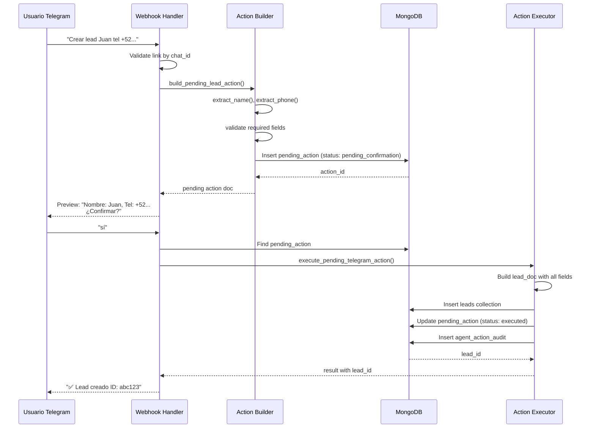
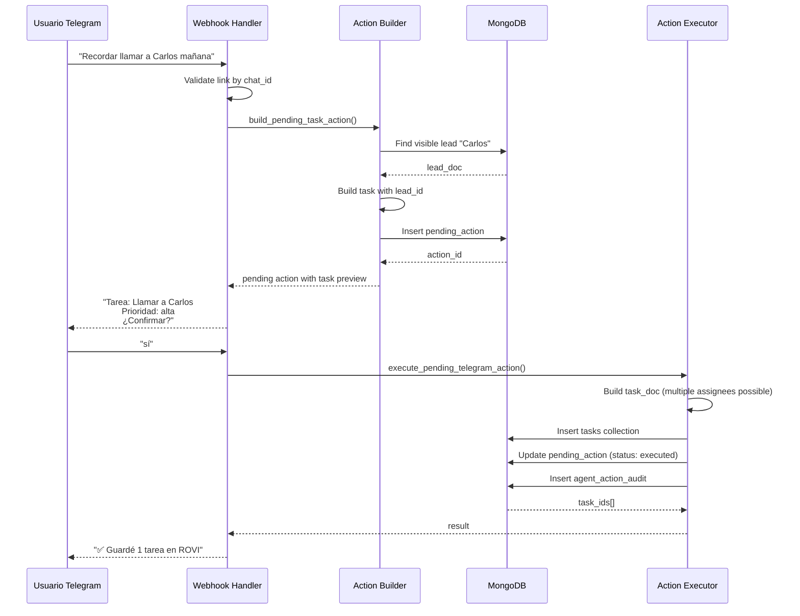
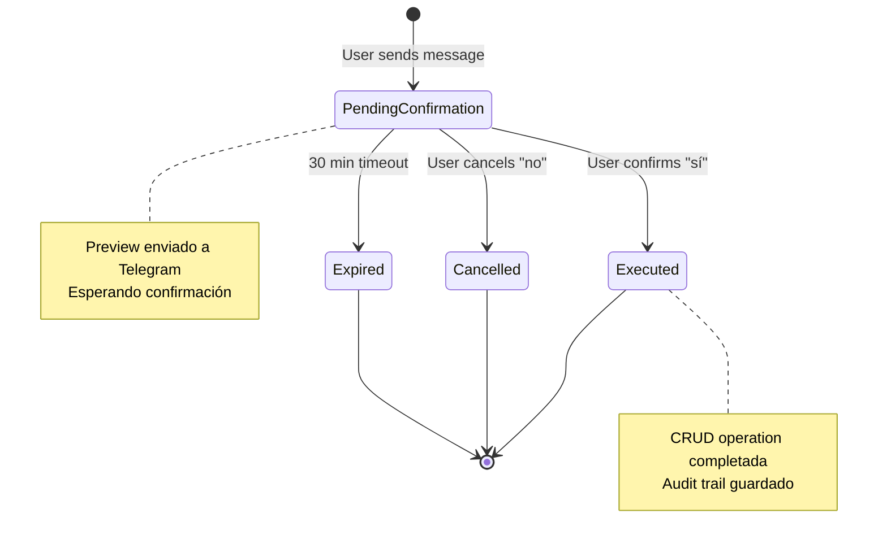
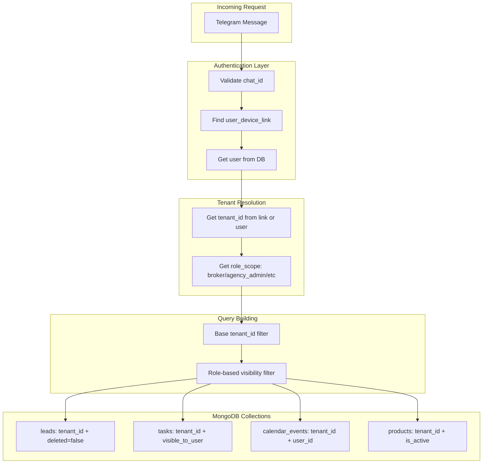
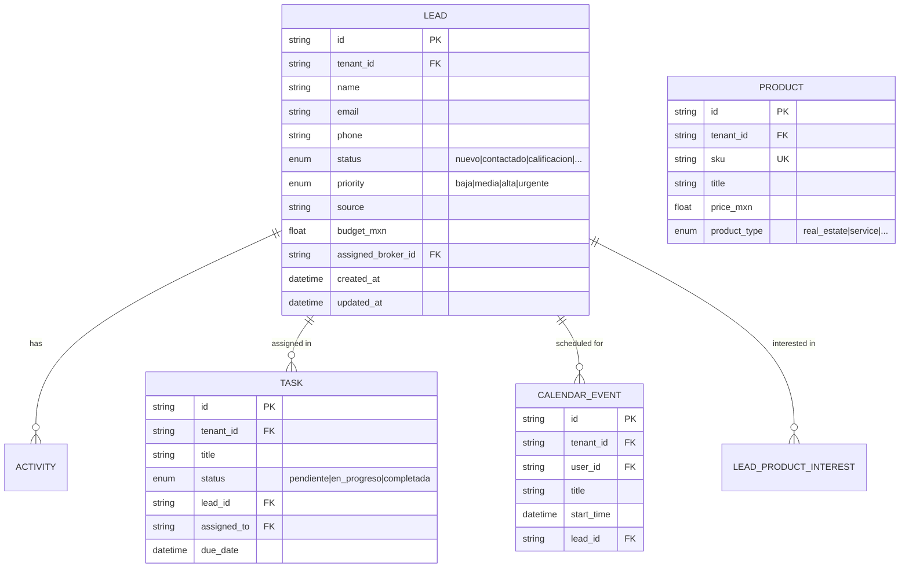
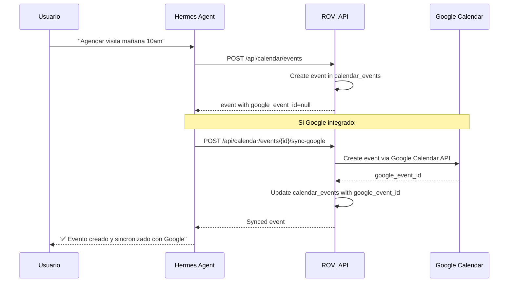

# Arquitectura del Agente Hermes - Diagramas

## 1. Diagrama de Arquitectura General

```mermaid
flowchart TB
    subgraph Telegram["Telegram Bot"]
        TUSER[Usuario]
        TBOT[Bot Hermes]
        TUSER -- "/envía mensaje" --> TBOT
    end

    subgraph Webhook["Webhook Layer"]
        WH[Webhook Handler<br/>/api/telegram/webhook]
        AUTH[Auth & Link Validation]
    end

    subgraph Processor["Message Processor"]
        INTENT[Intent Detector<br/>action type]
        BUILDER[Action Builder<br/>pending action]
        CONFIRM[Confirmation Flow]
        EXECUTOR[Action Executor<br/>CRUD operations]
    end

    subgraph Data[(MongoDB)]
        LEADS[leads]
        TASKS[tasks]
        EVENTS[calendar_events]
        PRODS[products]
        PENDING[telegram_agent_pending_actions]
        AUDIT[agent_action_audit]
    end

    subgraph AgentStudio["Agent Studio"]
        PROFILE[Profile Config]
        SETTINGS[User Settings]
    end

    TBOT -- "POST update" --> WH
    WH --> AUTH
    AUTH --> INTENT
    INTENT --> BUILDER
    BUILDER -- "save pending" --> PENDING
    BUILDER -- "preview" --> CONFIRM
    CONFIRM -- "user confirms" --> EXECUTOR
    CONFIRM -- "user cancels" --> PENDING
    EXECUTOR --> LEADS
    EXECUTOR --> TASKS
    EXECUTOR --> EVENTS
    EXECUTOR --> PRODS
    EXECUTOR --> AUDIT
    PROFILE -.-> AUTH
    SETTINGS -.-> INTENT
```

## 2. Flujo de CRUD - Crear Lead



## 3. Flujo de CRUD - Crear Tarea



## 4. Máquina de Estados de una Acción



## 5. Detección de Intención

```mermaid
flowchart LR
    TEXT[Mensaje de usuario] --> PATTERNS{Pattern matching}

    PATTERNS --|contiene "tarea<br/>recordar<br/>seguimiento"|> TASK_ACTION[build_pending_task_action]
    PATTERNS --|contiene "lead<br/>cliente<br/>prospecto"|> LEAD_ACTION[build_pending_lead_action]
    PATTERNS --|contiene "cita<br/>reunión<br/>visita"|> EVENT_ACTION[build_pending_event_action]
    PATTERNS --|contiene "propiedad<br/>inmueble<br/>lote"|> PROPERTY_ACTION[build_pending_property_action]
    PATTERNS --|contiene "actualizar<br/>cambiar<br/>status"|> UPDATE_ACTION[build_pending_lead_update_action]

    TASK_ACTION --> PREVIEW[Send preview to user]
    LEAD_ACTION --> PREVIEW
    EVENT_ACTION --> PREVIEW
    PROPERTY_ACTION --> PREVIEW
    UPDATE_ACTION --> PREVIEW
```

## 6. Multi-tenancy y Seguridad



## 7. Estructura de Datos - Lead



## 8. Integración con Google Calendar (Opcional)


